https://github.com/sajal2692/data-science-portfolio?tab=readme-ov-file


## Introduction

The data used in this analysis comes from *Principles of Econometrics* by Hill, Griffiths, and Lim (Wiley, 2008). The dataset `br.csv` includes 1080 observations on the prices and characteristics of houses sold in Baton Rouge, LA in 2005. The variables considered in the analysis are:

- **price**: Price of the house (in dollars)
- **sqft**: Total square feet
- **bedrooms**: Number of bedrooms
- **baths**: Number of full baths
- **age**: Age of the house in years
- **Occupancy**: Owner = 1, Vacant = 2, Tenant = 3
- **Pool**: Yes = 1, No = 0
- **Style**: 
  - Traditional = 1
  - Townhouse = 2
  - Ranch = 3
  - New Orleans = 4
  - Mobile Home = 5
  - Garden = 6
  - French = 7
  - Cottage = 8
  - Contemporary = 9
  - Colonial = 10
  - Acadian = 11
- **Fireplace**: Yes = 1, No = 0
- **Waterfront**: Yes = 1, No = 0
- **DOM**: Days on the market

## Data Loading and Preliminary Analysis


``` r
# Load the data
br <- read.table("/Users/fernandoloaizae/Library/CloudStorage/OneDrive-Personal/GitHub/Data_Projects/Data_Science/lab1/br.csv", sep = ",", header = TRUE)
attach(br)

# Histogram of price
hist(price, 30, col = "blue", main = "Histogram of Price")
```

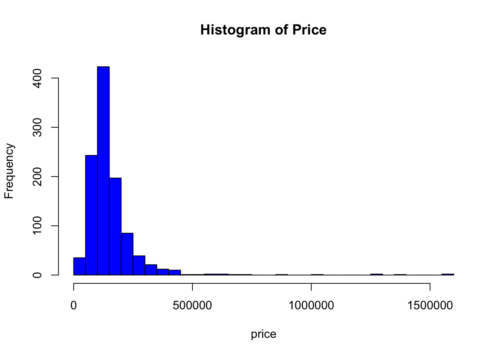

``` r
# Histogram of log-transformed price
hist(log(price), 30, col = "red", main = "Histogram of Log-Transformed Price")
```

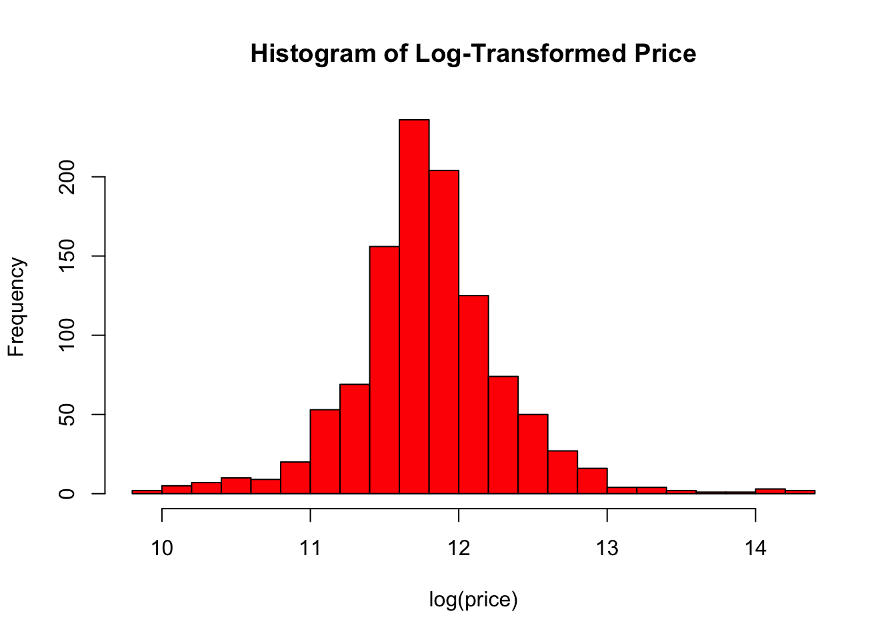

``` r
# Scatterplot of prices vs square feet
plot(sqft, price, col = "red", main = "Price vs Square Feet")
```

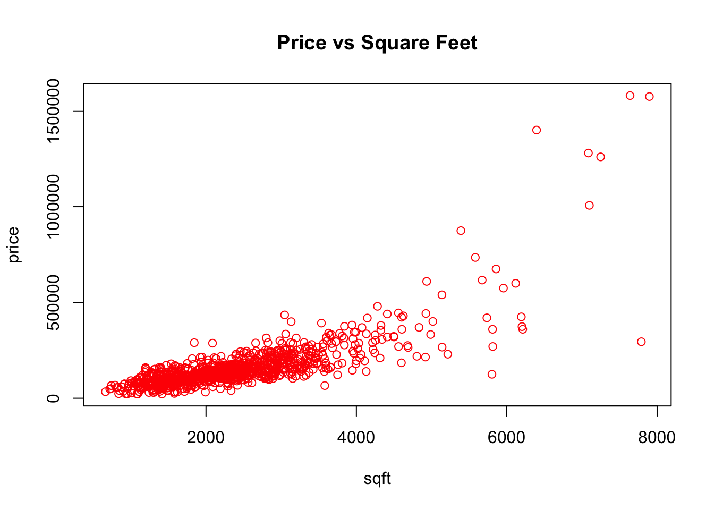

``` r
# Scatterplot of prices vs age
plot(Age, price, col = "red", main = "Price vs Age")
```

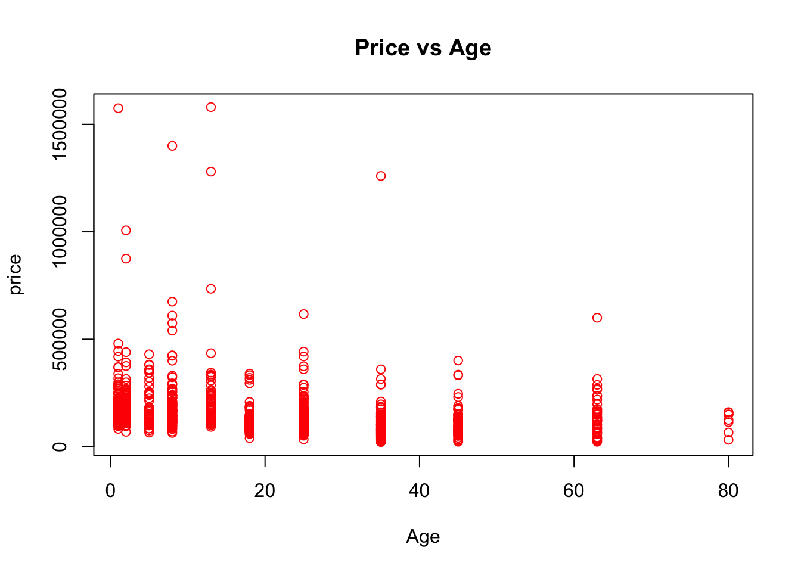

``` r
# Boxplot of price by Occupancy
plot(factor(Occupancy), price, col = 'red', main = "Price by Occupancy")
```

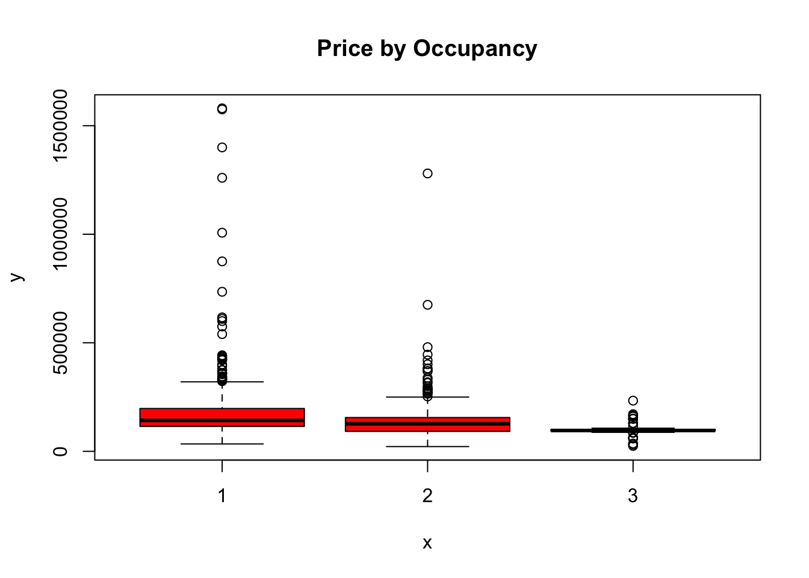

``` r
# Boxplot of price by Style
plot(factor(Style), price, col = 'yellow', main = "Price by Style")
```

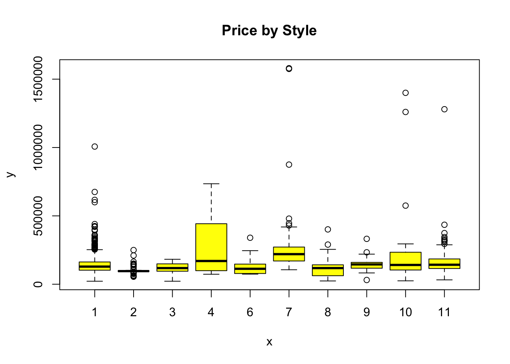

``` r
# Pair plot of price against square feet and age
pairs(price ~ sqft + Age, upper.panel = panel.smooth)
```

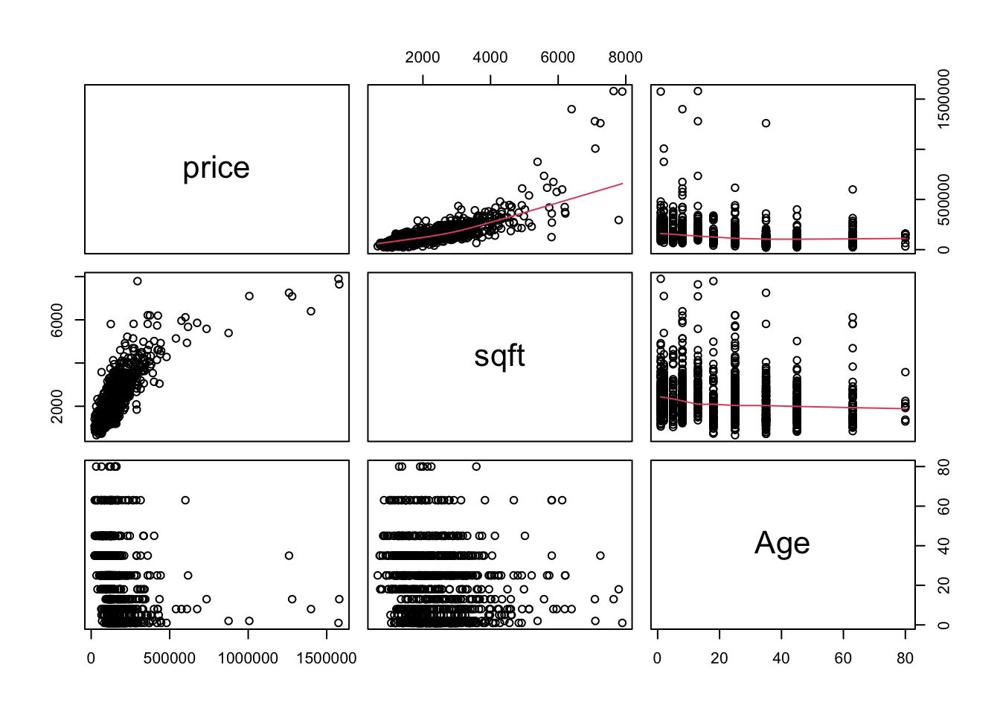

``` r
# Linear regression model
regr <- lm(price ~ sqft + Age + Pool + Bedrooms + Fireplace + Waterfront + DOM)
summary(regr)
```

```
## 
## Call:
## lm(formula = price ~ sqft + Age + Pool + Bedrooms + Fireplace + 
##     Waterfront + DOM)
## 
## Residuals:
##     Min      1Q  Median      3Q     Max 
## -351964  -31230   -3569   28695  878788 
## 
## Coefficients:
##               Estimate Std. Error t value Pr(>|t|)    
## (Intercept)   4336.851  12084.856   0.359    0.720    
## sqft            97.862      3.485  28.082  < 2e-16 ***
## Age           -694.671    141.292  -4.917 1.02e-06 ***
## Pool           815.028   8926.466   0.091    0.927    
## Bedrooms    -20923.878   4567.168  -4.581 5.16e-06 ***
## Fireplace      -97.130   5152.184  -0.019    0.985    
## Waterfront   63376.186   9389.874   6.749 2.43e-11 ***
## DOM            -20.988     24.841  -0.845    0.398    
## ---
## Signif. codes:  0 '***' 0.001 '**' 0.01 '*' 0.05 '.' 0.1 ' ' 1
## 
## Residual standard error: 76390 on 1072 degrees of freedom
## Multiple R-squared:  0.6162,	Adjusted R-squared:  0.6137 
## F-statistic: 245.9 on 7 and 1072 DF,  p-value: < 2.2e-16
```

``` r
# OLS coefficients
coefficients(regr)
```

```
##  (Intercept)         sqft          Age         Pool     Bedrooms    Fireplace 
##   4336.85051     97.86199   -694.67059    815.02821 -20923.87824    -97.13020 
##   Waterfront          DOM 
##  63376.18554    -20.98769
```

``` r
# Covariance matrix for model parameters
CovBeta <- vcov(regr)
CovBeta[2,2]  # Variance of beta_1_hat
```

```
## [1] 12.14399
```

``` r
sqrt(CovBeta[2,2])  # Standard error of beta_1_hat
```

```
## [1] 3.484823
```

``` r
# t statistic for beta_1_hat
coefficients(regr)[2] / sqrt(CovBeta[2,2])
```

```
##     sqft 
## 28.08234
```

``` r
# Confidence intervals for model parameters
confint(regr, level = 0.95)
```

```
##                    2.5 %       97.5 %
## (Intercept) -19375.80566  28049.50669
## sqft            91.02415    104.69984
## Age           -971.91094   -417.43024
## Pool        -16700.29956  18330.35599
## Bedrooms    -29885.48037 -11962.27611
## Fireplace   -10206.63972  10012.37932
## Waterfront   44951.56863  81800.80245
## DOM            -69.72962     27.75424
```

``` r
# Fitted values and residuals
yf <- fitted(regr)
e <- residuals(regr)

# Property of the residuals: zero mean
mean(e)
```

```
## [1] 3.584083e-12
```

``` r
# Histogram of residuals
hist(e, 60, col = 'blue', main = 'Histogram of Residuals')
```

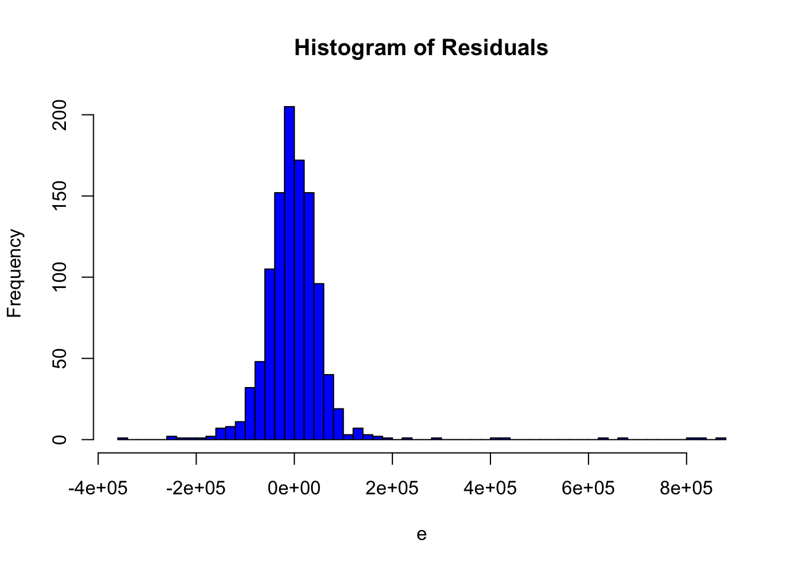

``` r
# Correlation checks
cor(yf, e)  # Residuals uncorrelated with fitted values
```

```
## [1] -1.708283e-16
```

``` r
cor(sqft, e)  # Residuals uncorrelated with sqft
```

```
## [1] -2.230843e-17
```

``` r
# Plot of predicted vs observed values
plot(price, yf, col = "red", main = "Predicted vs Observed Prices")
```

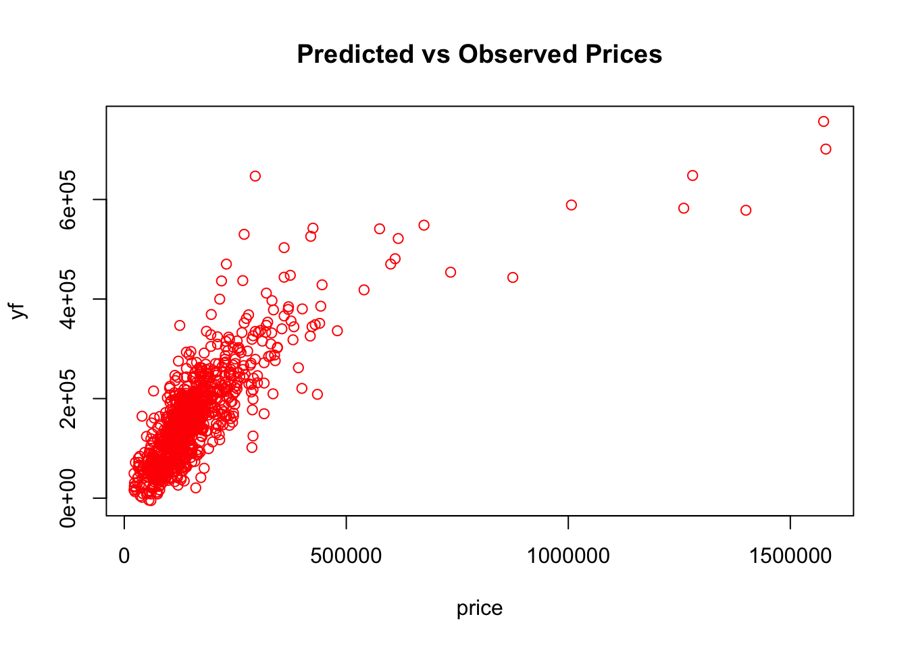

``` r
# Plot of residuals vs observed values
plot(price, e, col = "red", main = "Residuals vs Observed Prices")
abline(h = 0)
```

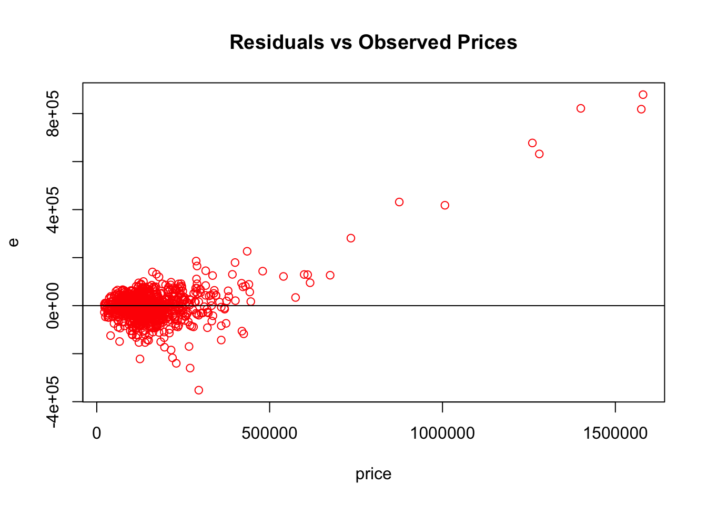

``` r
# Plot of residuals vs predicted values
plot(yf, e, col = "red", main = "Residuals vs Predicted Prices")
abline(h = 0)
```

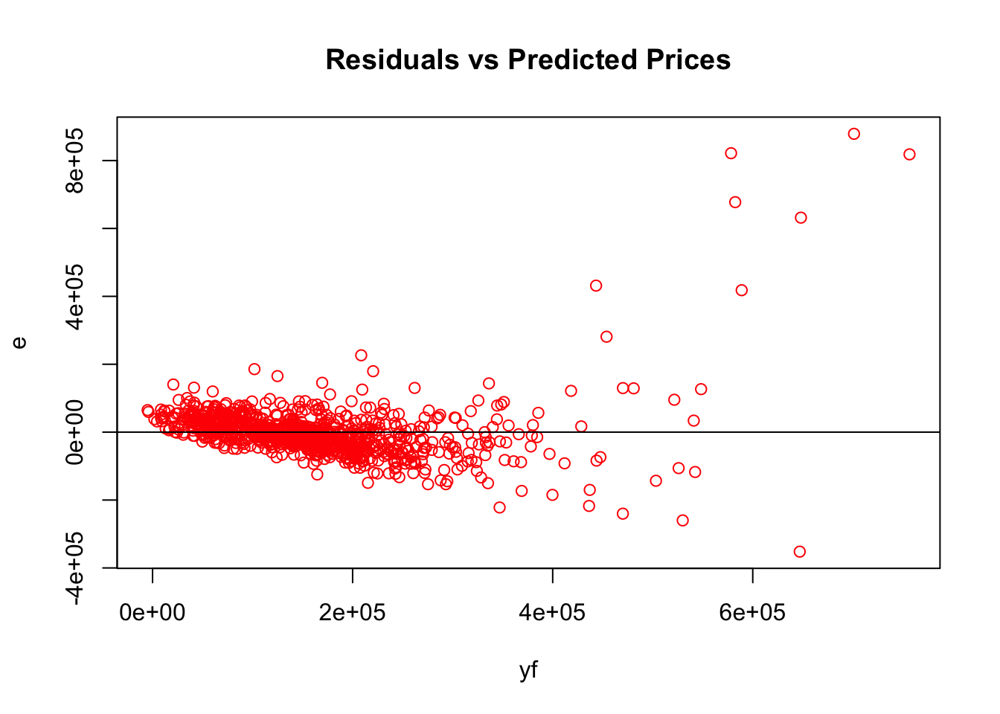

``` r
# Hat values (leverages)
h <- hatvalues(regr)
sum(h)  # Trace(H) = p+1
```

```
## [1] 8
```

``` r
mean(h)
```

```
## [1] 0.007407407
```

``` r
# Barplot of hat values
barplot(h, col = 'blue', main = "Hat Values")
abline(h = mean(h), col = 'red')
```

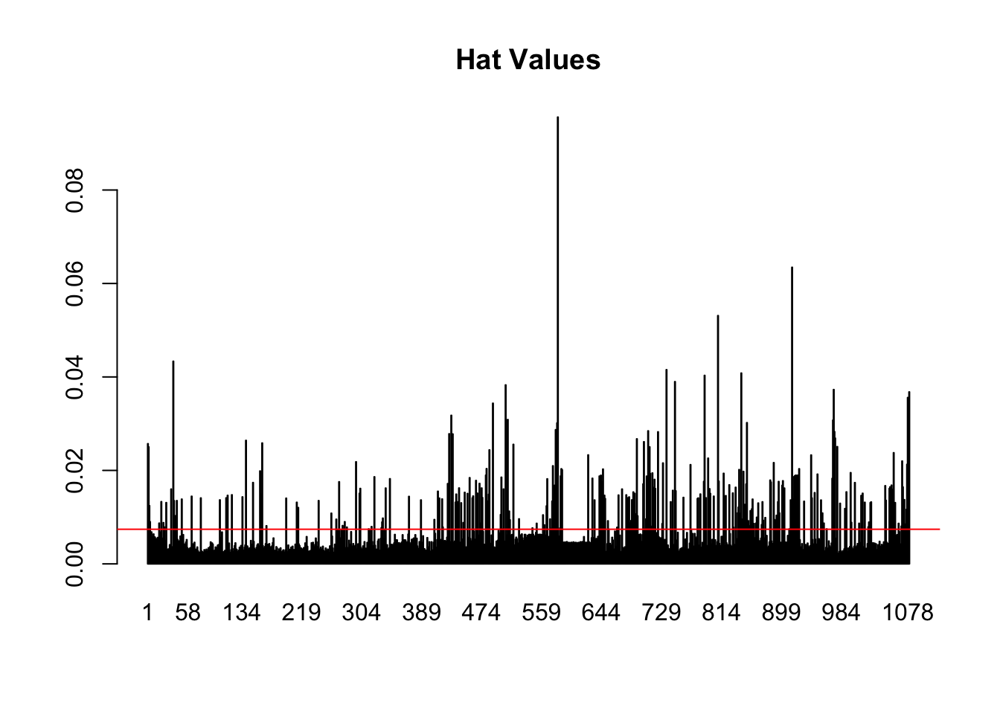

``` r
# Standardized residuals
r <- rstandard(regr)

# Plot of standardized residuals vs fitted values
plot(yf, r, main = "Standardized Residuals vs Fitted Values")
```

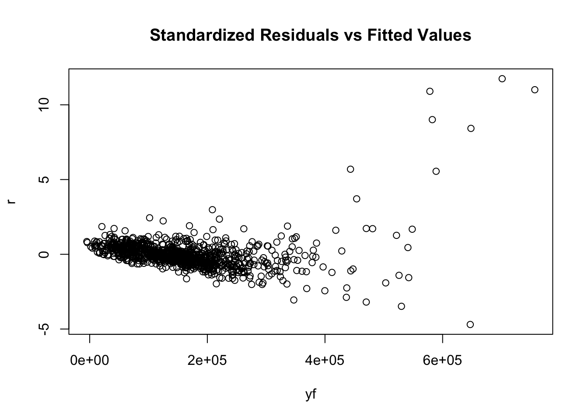

``` r
# Plot of standardized residuals vs hat values
plot(h, r, main = "Standardized Residuals vs Hat Values")
```

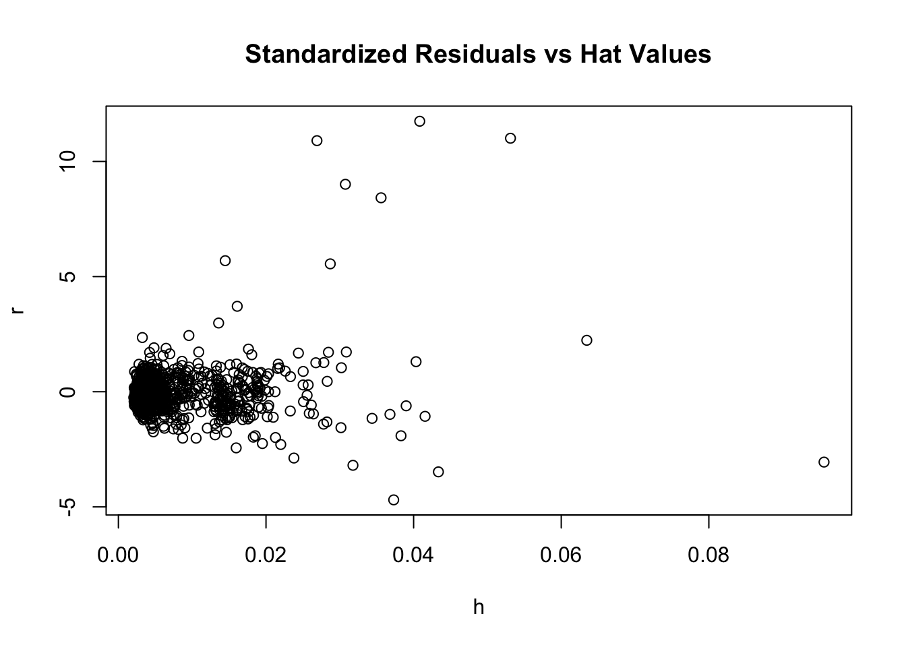

``` r
# Regression model with categorical variables
regr2 <- lm(price ~ sqft + Age + Pool + Bedrooms + Pool + Fireplace + Waterfront + DOM + factor(Occupancy) + factor(Style))
summary(regr2)
```

```
## 
## Call:
## lm(formula = price ~ sqft + Age + Pool + Bedrooms + Pool + Fireplace + 
##     Waterfront + DOM + factor(Occupancy) + factor(Style))
## 
## Residuals:
##     Min      1Q  Median      3Q     Max 
## -394333  -30507   -1449   24068  847015 
## 
## Coefficients:
##                      Estimate Std. Error t value Pr(>|t|)    
## (Intercept)        -18876.891  14110.471  -1.338  0.18125    
## sqft                   95.078      3.473  27.375  < 2e-16 ***
## Age                  -612.373    154.218  -3.971 7.65e-05 ***
## Pool                  851.568   8969.349   0.095  0.92438    
## Bedrooms           -13531.311   4817.779  -2.809  0.00507 ** 
## Fireplace           -1438.546   5283.999  -0.272  0.78549    
## Waterfront          60294.318   9278.459   6.498 1.25e-10 ***
## DOM                   -42.653     24.976  -1.708  0.08798 .  
## factor(Occupancy)2  -4031.259   5061.911  -0.796  0.42598    
## factor(Occupancy)3  13534.915  12265.601   1.103  0.27007    
## factor(Style)2      30641.304  11707.898   2.617  0.00899 ** 
## factor(Style)3     -10355.218  10666.633  -0.971  0.33187    
## factor(Style)4      77910.784  21375.017   3.645  0.00028 ***
## factor(Style)6      19332.391  14138.488   1.367  0.17180    
## factor(Style)7      43082.954   8866.726   4.859 1.36e-06 ***
## factor(Style)8      30722.878  10330.864   2.974  0.00301 ** 
## factor(Style)9      -3504.115  12408.244  -0.282  0.77769    
## factor(Style)10     52748.789  17591.747   2.998  0.00278 ** 
## factor(Style)11    -13204.124   8017.223  -1.647  0.09986 .  
## ---
## Signif. codes:  0 '***' 0.001 '**' 0.01 '*' 0.05 '.' 0.1 ' ' 1
## 
## Residual standard error: 74180 on 1061 degrees of freedom
## Multiple R-squared:  0.6419,	Adjusted R-squared:  0.6358 
## F-statistic: 105.6 on 18 and 1061 DF,  p-value: < 2.2e-16
```

``` r
# Model updates by adding and removing variables
summary(update(regr2,  .~. - Fireplace))
```

```
## 
## Call:
## lm(formula = price ~ sqft + Age + Pool + Bedrooms + Waterfront + 
##     DOM + factor(Occupancy) + factor(Style))
## 
## Residuals:
##     Min      1Q  Median      3Q     Max 
## -393805  -30397   -1346   23996  847865 
## 
## Coefficients:
##                      Estimate Std. Error t value Pr(>|t|)    
## (Intercept)        -19717.443  13762.544  -1.433 0.152241    
## sqft                   94.856      3.375  28.103  < 2e-16 ***
## Age                  -606.949    152.859  -3.971 7.65e-05 ***
## Pool                  790.299   8962.616   0.088 0.929752    
## Bedrooms           -13419.634   4798.191  -2.797 0.005254 ** 
## Waterfront          60317.628   9274.019   6.504 1.20e-10 ***
## DOM                   -42.935     24.944  -1.721 0.085494 .  
## factor(Occupancy)2  -3706.514   4917.213  -0.754 0.451146    
## factor(Occupancy)3  14047.888  12114.726   1.160 0.246484    
## factor(Style)2      30636.505  11702.780   2.618 0.008974 ** 
## factor(Style)3     -10412.615  10659.899  -0.977 0.328889    
## factor(Style)4      77963.692  21364.814   3.649 0.000276 ***
## factor(Style)6      19096.941  14105.859   1.354 0.176079    
## factor(Style)7      42678.895   8737.817   4.884 1.20e-06 ***
## factor(Style)8      30767.727  10325.047   2.980 0.002949 ** 
## factor(Style)9      -3773.816  12363.242  -0.305 0.760239    
## factor(Style)10     52723.313  17583.828   2.998 0.002777 ** 
## factor(Style)11    -13354.783   7994.614  -1.670 0.095121 .  
## ---
## Signif. codes:  0 '***' 0.001 '**' 0.01 '*' 0.05 '.' 0.1 ' ' 1
## 
## Residual standard error: 74140 on 1062 degrees of freedom
## Multiple R-squared:  0.6419,	Adjusted R-squared:  0.6361 
## F-statistic:   112 on 17 and 1062 DF,  p-value: < 2.2e-16
```

``` r
summary(update(regr2,  .~. - factor(Occupancy)))
```

```
## 
## Call:
## lm(formula = price ~ sqft + Age + Pool + Bedrooms + Fireplace + 
##     Waterfront + DOM + factor(Style))
## 
## Residuals:
##     Min      1Q  Median      3Q     Max 
## -394995  -31459   -1684   24150  848051 
## 
## Coefficients:
##                  Estimate Std. Error t value Pr(>|t|)    
## (Intercept)     -20602.56   13705.12  -1.503 0.133065    
## sqft                95.24       3.44  27.682  < 2e-16 ***
## Age               -592.24     153.52  -3.858 0.000121 ***
## Pool              1285.38    8962.76   0.143 0.885991    
## Bedrooms        -13725.03    4810.03  -2.853 0.004409 ** 
## Fireplace        -1118.95    5113.13  -0.219 0.826818    
## Waterfront       60061.26    9279.46   6.472 1.47e-10 ***
## DOM                -46.92      24.68  -1.901 0.057521 .  
## factor(Style)2   37308.32   10424.24   3.579 0.000360 ***
## factor(Style)3  -10879.12   10663.83  -1.020 0.307871    
## factor(Style)4   77576.34   21376.62   3.629 0.000298 ***
## factor(Style)6   19169.65   14123.39   1.357 0.174975    
## factor(Style)7   43267.34    8862.39   4.882 1.21e-06 ***
## factor(Style)8   31407.00   10320.59   3.043 0.002399 ** 
## factor(Style)9   -3144.59   12395.06  -0.254 0.799779    
## factor(Style)10  54694.64   17532.06   3.120 0.001859 ** 
## factor(Style)11 -12423.08    7997.39  -1.553 0.120627    
## ---
## Signif. codes:  0 '***' 0.001 '**' 0.01 '*' 0.05 '.' 0.1 ' ' 1
## 
## Residual standard error: 74190 on 1063 degrees of freedom
## Multiple R-squared:  0.641,	Adjusted R-squared:  0.6356 
## F-statistic: 118.6 on 16 and 1063 DF,  p-value: < 2.2e-16
```


